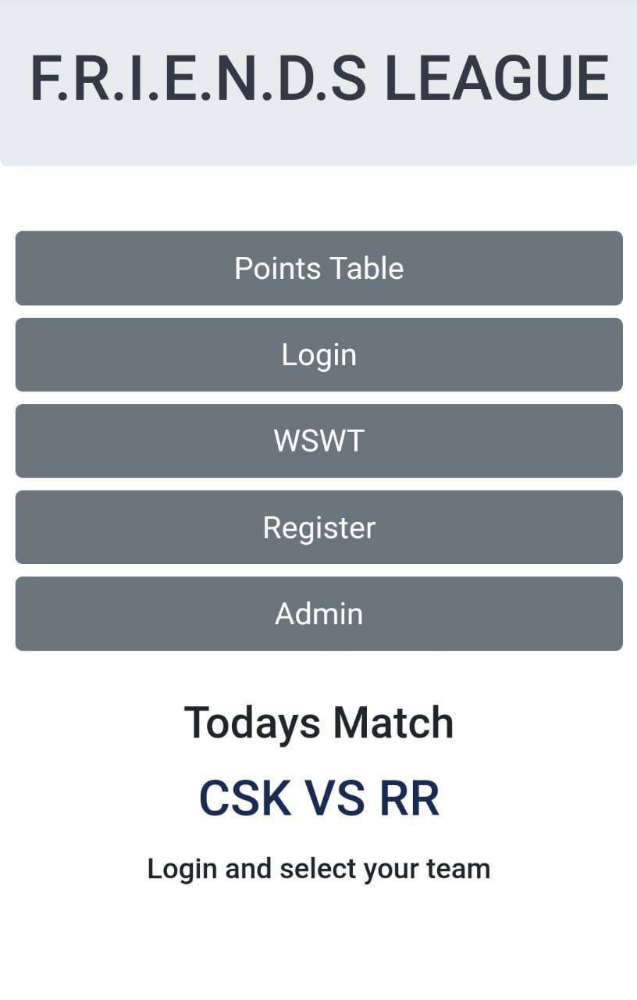

# FLeague 

## Overview 👀

## What is Fleague 🤔

#### Fleague is a league that is a competetion between your friends in ipl season.

#### I think many of you like to compete with your friends in this ipl season.Then Fleague is the best.

### [Demo]

## Documentation

In Fleague,There will be a admin and can be any no of users.

## How to start with Fleague:-
### For Admin:-

1.Clone my project and run "npm start i" to create node_modules.

2.Create a google firebase account and create a project of any name and get the Api Key. Add that Api Key to the fireBase Config File.

3.To setup fleague, Go to Admin>Enter admin password - "password"(Default Password).

4.Admin Password can be changed in Admin File.

5.First Click on the Setup button to setup the fleague.

6.Admin should update the team everyday and should set the winTeam and reset after every match.

Note:WinTeam should'nt be Submit more than one time.

7.Calculate Score is the button which will be useful if you find any wrong data with the users score.

8.You can stop accepting responses from users by clicking the button "Stop accepting Responses" and can accept again by clicking "Accept Responses".

### For User:-
Register yourself and login to select the team thats it.

## WIP

#### 1.Allowing Users to change their password.
#### 2.Setting Win Team and setting teams will be automated.

[Demo]:https://frndsleague.netlify.app
